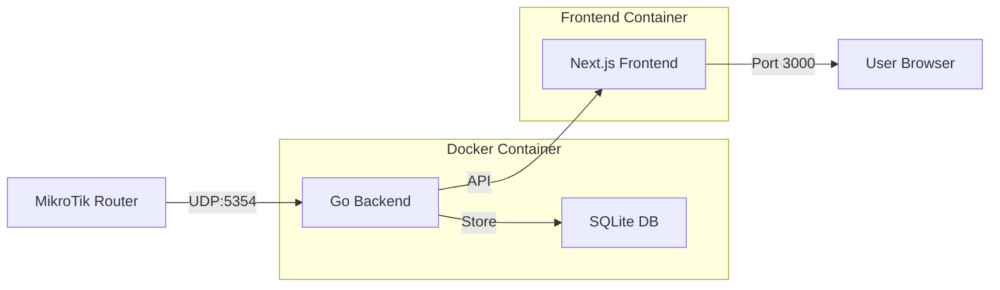

# 🔍 MikroTik DNS Analytics

> Modern real-time DNS analytics dashboard for MikroTik routers with beautiful web interface


A comprehensive DNS analytics solution that receives DNS logs from MikroTik routers via UDP, stores them in SQLite, and presents beautiful real-time statistics through a modern React dashboard.


---

## ✨ Features

### 🎯 **Modern Dashboard**

- **Real-time Statistics**: Auto-refreshing dashboard with customizable intervals (5s-5min)
- **Modern UI**: Next.js 15 + React 19 with Tailwind CSS and Radix UI components
- **Responsive Design**: Works perfectly on desktop, tablet, and mobile devices
- **Animated Numbers**: Smooth transitions when data updates
- **Interactive Elements**: Click-to-copy functionality throughout the interface

### 📊 **Comprehensive Analytics**

- **Overview Page**: Modern cards with gradients, IPv4 vs IPv6 adoption, query rates
- **Top Domains**: Visual ranking with progress bars and interactive selection
- **Client Analysis**: Most active clients with detailed query history
- **Domain Search**: Powerful search with partial matching capabilities
- **Query Types**: Distribution analysis with special highlighting for unknown queries
- **Network Insights**: Query rates, resolution success rates, client distribution

### 🔧 **Advanced Functionality**

- **Domain → Clients**: Click any domain to see which clients are querying it
- **Client → Domains**: Click any client to see their query history
- **IPv4/IPv6 Tracking**: Monitor protocol adoption in your network
- **Failed Query Analysis**: Identify and troubleshoot DNS resolution issues
- **Real-time Metrics**: Queries per minute, active clients, unique domains

### 🚀 **Production Ready**

- **Docker Containerized**: Complete containerization with Docker Compose
- **API Proxy**: Single port deployment (3000) with backend proxying
- **Optimized Backend**: Efficient Go API with SQLite and proper CORS
- **Auto-purging**: Automatically removes data older than 24 hours
- **Error Handling**: Robust error handling and null-safe operations

---

## 🏃‍♂️ Quick Start

### 1. Using Docker Compose (Recommended)

```bash
# Clone the repository
git clone https://github.com/publi0/mikrotik-dns.git
cd mikrotik-dns

# Start all services
docker compose up -d --build

# View logs
docker compose logs -f
```

**Access the dashboard:**

- 🌐 **Web Dashboard**: http://localhost:3000
- 📡 **UDP Logs**: Port 5354 (for MikroTik)

### 2. Using Makefile

```bash
# Check if all tools are available
make check-tools

# Build and start services
make docker-build
make docker-up

# View real-time logs
make docker-logs

# Stop services
make docker-down
```

---

## 📡 MikroTik Configuration

Configure your MikroTik router to send DNS logs:

### Option 1: WebFig/Winbox GUI

1. Go to **System → Logging**
2. Add new rule:
   - **Topics**: `dns`
   - **Action**: `remote`
   - **Remote Address**: `<your_server_ip>`
   - **Remote Port**: `5354`

### Option 2: Command Line Interface

```shell
/system logging add topics=dns action=remote remote=<your_server_ip> remote-port=5354
```

### Expected Log Format

```
2025-01-15 14:23:45 dns query from 192.168.1.100: #12345 google.com. A
2025-01-15 14:23:46 dns query from 192.168.1.100: #12346 facebook.com. AAAA
```

---

## 🏗️ Architecture



## 📊 API Endpoints

### Core Statistics

- `GET /api/top-domains` - Most queried domains
- `GET /api/query-types` - DNS query type distribution
- `GET /api/clients` - Most active client IPs
- `GET /api/unique-clients-count` - Count of unique clients
- `GET /api/unique-domains-count` - Count of unique domains

### Advanced Analytics

- `GET /api/queries-per-minute` - Average queries per minute
- `GET /api/ipv4-vs-ipv6` - IPv4 vs IPv6 usage statistics
- `GET /api/all-queries?page=1&page_size=50` - Recent queries with pagination

### Interactive Features

- `GET /api/client-queries?client=<ip>&page=1` - Queries from specific client
- `GET /api/domain-clients?domain=<domain>&page=1` - Clients querying specific domain
- `GET /api/domain-queries?domain=<domain>&partial=true&page=1` - Search domains

---

## 🎨 Dashboard Features

### Overview Page

- **Modern Gradient Cards**: Beautiful statistics with color-coded themes
- **IPv4/IPv6 Adoption**: Visual progress bars showing protocol usage
- **Network Health**: Resolution success rates and query performance
- **Real-time Metrics**: Live query rates and client distribution

### Domains Page

- **Interactive Domain List**: Click any domain to see client details
- **Client Analysis**: Shows which clients query specific domains
- **Query Counts**: Number of queries per client for selected domain
- **Last Activity**: Timestamp of most recent query

### Clients Page

- **Active Client Ranking**: Most active IP addresses
- **Query History**: Detailed query log for each client
- **Domain Breakdown**: What domains each client is accessing

### Search Page

- **Live DNS Resolution**: Real-time DNS lookup for search results matching the original query type
- **Query Type Specific**: Resolves A, AAAA, CNAME, TXT, MX, NS, PTR records based on logged query type
- **Block Detection**: Identifies blocked or non-existent domains
- **Performance Metrics**: Shows DNS resolution time for each domain
- **Copy Functionality**: One-click copy for domains and DNS records

### All Queries Page

- **Complete Query Log**: Chronological list of all DNS queries
- **Table Layout**: Organized columns for time, client, domain, type
- **Responsive Design**: Proper column widths regardless of data length

---

## ⚙️ Configuration

### Environment Variables

- `BACKEND_URL`: Internal backend URL for API proxy (default: `http://mikrotik-dns-backend:8080`)
- `DATABASE_PATH`: SQLite database location (default: `/data/queries.db`)
- `DNS_SERVER`: Custom DNS server for resolution testing (optional, uses system default if not set)

### Auto-refresh Settings

- **5 seconds**: Real-time monitoring
- **10 seconds**: Active monitoring
- **30 seconds**: Regular updates
- **1 minute**: Casual monitoring
- **5 minutes**: Background monitoring

---

## 🔧 Development

### Local Development

```bash
# Backend
go mod tidy
go run main.go

# Frontend (in separate terminal)
cd page
npm install
npm run dev
```

### Building from Source

```bash
# Backend
CGO_ENABLED=1 go build -o mikrotik-dns .

# Frontend
cd page
npm run build
```

---

## 📦 Docker Configuration

### Single Port Deployment

The application now uses a single port (3000) with backend API proxying:

```yaml
services:
  mikrotik-dns-backend:
    build: .
    expose:
      - "8080" # Internal only
    ports:
      - "5354:5354/udp" # MikroTik logs

  mikrotik-dns-frontend:
    build:
      context: ./page
    ports:
      - "3000:3000" # Public access
    environment:
      - BACKEND_URL=http://mikrotik-dns-backend:8080
```

---

## 🗄️ Database Schema

SQLite database with automatic cleanup (24h retention):

```sql
CREATE TABLE queries (
    id INTEGER PRIMARY KEY,
    timestamp INTEGER,
    client TEXT,
    domain TEXT,
    type TEXT
);
```

---

## 🐛 Troubleshooting

### No Data Appearing

1. Check MikroTik logging configuration
2. Verify UDP port 5354 is accessible
3. Check container logs: `docker compose logs -f`

### DNS Resolution Issues

- Monitor "Failed Queries" card for UNKNOWN query types
- Check "Resolution Rate" in Activity Summary
- Use Domain Search to investigate specific issues

### Performance Issues

- Monitor "Query Rate" metrics
- Check "Avg. per Client" statistics
- Review IPv4/IPv6 distribution for network optimization

### Build Issues

- Ensure CGO is enabled for SQLite support
- Check Docker build context includes all necessary files
- Verify Node.js dependencies are properly installed

---

## 🤝 Contributing

1. Fork the repository
2. Create a feature branch: `git checkout -b feature/amazing-feature`
3. Commit changes: `git commit -m 'Add amazing feature'`
4. Push to branch: `git push origin feature/amazing-feature`
5. Open a Pull Request

---

## 📄 License

This project is licensed under the MIT License - see the [LICENSE](LICENSE) file for details.

---

## 🙏 Acknowledgments

- **MikroTik**: For excellent router hardware and logging capabilities
- **Go**: For the efficient backend implementation
- **Next.js & React**: For the modern frontend framework
- **Tailwind CSS**: For the beautiful and responsive design
- **Radix UI**: For accessible and customizable components
- **SQLite**: For the lightweight and reliable database

---

<div align="center">

Made with ❤️ for network administrators and DNS enthusiasts

</div>
